# Scoring System Notification Flow

## Overview

This document illustrates the notification flow for the proposal scoring system, showing when and how emails are triggered.

## Notification Triggers

### 1. Proposal Scored (First Time)

```mermaid
sequenceDiagram
    participant Client
    participant System
    participant Database
    participant EmailService
    participant Lead

    Client->>System: Finalize Scoring
    System->>Database: Mark scores as final
    System->>Database: Recalculate rankings
    System->>Database: Get proposal & lead details
    System->>EmailService: Send "Proposal Scored" email
    EmailService->>Lead: 📧 Email with score & rank
    System->>Database: Check if all proposals scored
    alt All proposals scored
        System->>Database: Get client details
        System->>EmailService: Send "All Scored" email
        EmailService->>Client: 📧 Email with completion notice
    end
    System->>Client: Success response
```



**Email Content:**
- Total score achieved
- Current ranking position
- Link to view detailed scores
- Next steps guidance

### 2. Scores Revised

```mermaid
sequenceDiagram
    participant Client
    participant System
    participant Database
    participant EmailService
    participant Lead

    Client->>System: Revise Score
    System->>Database: Get previous ranking
    System->>Database: Update score
    System->>Database: Recalculate rankings
    System->>Database: Get new ranking
    System->>Database: Get proposal & lead details
    System->>EmailService: Send "Score Updated" email
    EmailService->>Lead: 📧 Email with before/after comparison
    System->>Client: Success response
```



**Email Content:**
- Previous score vs new score
- Score change amount (±)
- Previous rank vs new rank
- Visual indicators (📈📉⬆️⬇️➡️)
- Link to view updated scores

### 3. All Proposals Scored

```mermaid
sequenceDiagram
    participant Client
    participant System
    participant Database
    participant EmailService

    Client->>System: Finalize last proposal
    System->>Database: Mark scores as final
    System->>Database: Recalculate rankings
    System->>Database: Check all proposals
    alt All proposals fully scored
        System->>Database: Get project & client details
        System->>Database: Get top-ranked proposal
        System->>EmailService: Send "All Scored" email
        EmailService->>Client: 📧 Email with completion notice
    end
    System->>Client: Success response
```



**Email Content:**
- Total number of proposals scored
- Top-ranked proposal details
- Link to view complete rankings
- Next steps for decision-making

## Notification Decision Tree

```
┌─────────────────────────────────────┐
│   Client Performs Scoring Action   │
└──────────────┬──────────────────────┘
               │
               ▼
        ┌──────────────┐
        │ Action Type? │
        └──────┬───────┘
               │
       ┌───────┴────────┐
       │                │
       ▼                ▼
┌─────────────┐  ┌─────────────┐
│  Finalize   │  │   Revise    │
│   Scoring   │  │    Score    │
└──────┬──────┘  └──────┬──────┘
       │                │
       ▼                ▼
┌─────────────┐  ┌─────────────┐
│ Send Lead   │  │ Get Previous│
│   Scored    │  │   Ranking   │
│   Email     │  └──────┬──────┘
└──────┬──────┘         │
       │                ▼
       │         ┌─────────────┐
       │         │ Update Score│
       │         └──────┬──────┘
       │                │
       │                ▼
       │         ┌─────────────┐
       │         │ Get New     │
       │         │  Ranking    │
       │         └──────┬──────┘
       │                │
       │                ▼
       │         ┌─────────────┐
       │         │ Send Lead   │
       │         │  Updated    │
       │         │   Email     │
       │         └─────────────┘
       │
       ▼
┌─────────────┐
│ Check All   │
│  Proposals  │
│   Scored?   │
└──────┬──────┘
       │
   ┌───┴───┐
   │       │
   ▼       ▼
 ┌───┐  ┌────┐
 │Yes│  │ No │
 └─┬─┘  └────┘
   │
   ▼
┌─────────────┐
│ Send Client │
│  All Scored │
│    Email    │
└─────────────┘
```

## Email Template Examples

### 1. Proposal Scored Email

**Subject:** Your Proposal Has Been Scored: [Proposal Title]

**Key Elements:**
- Greeting with lead name
- Scoring results box (project, proposal, score, rank)
- Call-to-action button
- Next steps guidance

**Visual Indicators:**
- Yellow accent color for score/rank
- BidSync branding
- Mobile-responsive layout

### 2. Score Updated Email

**Subject:** Scores Updated for Your Proposal: [Proposal Title]

**Key Elements:**
- Greeting with lead name
- Score update box with before/after
- Visual change indicators:
  - 📈 Score increased
  - 📉 Score decreased
  - ⬆️ Rank improved
  - ⬇️ Rank declined
  - ➡️ Rank unchanged
- Call-to-action button
- Contextual messaging

### 3. All Proposals Scored Email

**Subject:** All Proposals Scored for [Project Title]

**Key Elements:**
- Congratulatory greeting
- Scoring complete box (proposal count, top proposal)
- Call-to-action button
- Next steps checklist
- Decision-making guidance

## Error Handling Flow

```
┌─────────────────────────────────────┐
│   Notification Function Called      │
└──────────────┬──────────────────────┘
               │
               ▼
        ┌──────────────┐
        │ Fetch Data   │
        └──────┬───────┘
               │
       ┌───────┴────────┐
       │                │
       ▼                ▼
   ┌────────┐      ┌────────┐
   │Success │      │ Error  │
   └───┬────┘      └───┬────┘
       │               │
       │               ▼
       │        ┌─────────────┐
       │        │ Log Error   │
       │        └──────┬──────┘
       │               │
       │               ▼
       │        ┌─────────────┐
       │        │Return Error │
       │        │  (No Throw) │
       │        └─────────────┘
       │
       ▼
┌─────────────┐
│ Generate    │
│   Email     │
└──────┬──────┘
       │
       ▼
┌─────────────┐
│ Send Email  │
└──────┬──────┘
       │
   ┌───┴───┐
   │       │
   ▼       ▼
┌────┐  ┌────┐
│ OK │  │Fail│
└─┬──┘  └─┬──┘
  │       │
  │       ▼
  │  ┌─────────┐
  │  │Log Error│
  │  └────┬────┘
  │       │
  ▼       ▼
┌─────────────┐
│Return Status│
│(No Throw)   │
└─────────────┘
```

## Key Design Principles

### 1. Non-Blocking
- Notification failures never prevent scoring operations
- All errors caught and logged
- Operations complete successfully regardless of email status

### 2. Timely
- Notifications sent immediately after scoring events
- No delays or batching (except for future digest feature)
- Real-time updates keep users informed

### 3. Relevant
- Only send when meaningful events occur
- Client notification only when ALL proposals scored
- Avoid notification spam

### 4. Informative
- Include all relevant details
- Provide context and next steps
- Visual indicators for changes

### 5. Actionable
- Clear call-to-action buttons
- Direct links to relevant pages
- Guidance on what to do next

## Integration Points

### GraphQL Mutations

1. **finalizeScoring**
   - Location: `lib/graphql/resolvers.ts`
   - Triggers: Lead scored + Client all scored (conditional)
   - Error handling: Try-catch with logging

2. **reviseScore**
   - Location: `lib/graphql/resolvers.ts`
   - Triggers: Lead score updated
   - Error handling: Try-catch with logging

### Email Service

1. **Service Layer**
   - Location: `lib/email/service.ts`
   - Handles: Retry logic, queue management
   - Development: Console logging

2. **Templates**
   - Location: `lib/email/templates.ts`
   - Provides: HTML and text versions
   - Design: BidSync yellow-black theme

3. **Notifications**
   - Location: `lib/email/scoring-notifications.ts`
   - Provides: Business logic for notifications
   - Handles: Data fetching and validation

## Testing Strategy

### Unit Tests
- Email template generation
- Content validation
- Visual indicator logic
- URL generation

### Integration Tests (Future)
- End-to-end notification flow
- Database interaction
- Email service integration
- Error handling scenarios

### Manual Testing
- Development mode console output
- Email preview in email clients
- Mobile responsiveness
- Accessibility compliance

## Monitoring and Observability

### Logging
All notification events are logged:
```
✅ Lead scored notification sent successfully to user@example.com
❌ Failed to send score updated notification: [error details]
```

### Metrics to Track (Future)
- Notification success rate
- Email delivery rate
- Open rate
- Click-through rate
- Time to send
- Error frequency

## Configuration

### Development
```env
NODE_ENV=development
# Emails logged to console
```

### Production
```env
EMAIL_PROVIDER=smtp
SMTP_HOSTNAME=smtp.example.com
SMTP_PORT=587
SMTP_USERNAME=your-username
SMTP_PASSWORD=your-password
SMTP_FROM=noreply@bidsync.com
NEXT_PUBLIC_SUPABASE_URL=https://bidsync.com
```

## Future Enhancements

1. **Notification Preferences**
   - User settings for email frequency
   - Opt-in/opt-out per notification type
   - Digest mode (daily/weekly summaries)

2. **Multi-Channel**
   - In-app notifications
   - SMS for critical updates
   - Push notifications (mobile app)

3. **Advanced Features**
   - Email templates customization
   - Webhook support for integrations
   - Analytics dashboard
   - A/B testing for email content

4. **Internationalization**
   - Multi-language support
   - Timezone-aware timestamps
   - Localized formatting

## Related Documentation

- [Scoring Notifications README](../lib/email/scoring-notifications.README.md)
- [Email Service](../lib/email/service.ts)
- [Email Templates](../lib/email/templates.ts)
- [Scoring System Design](../.kiro/specs/proposal-scoring-system/design.md)
